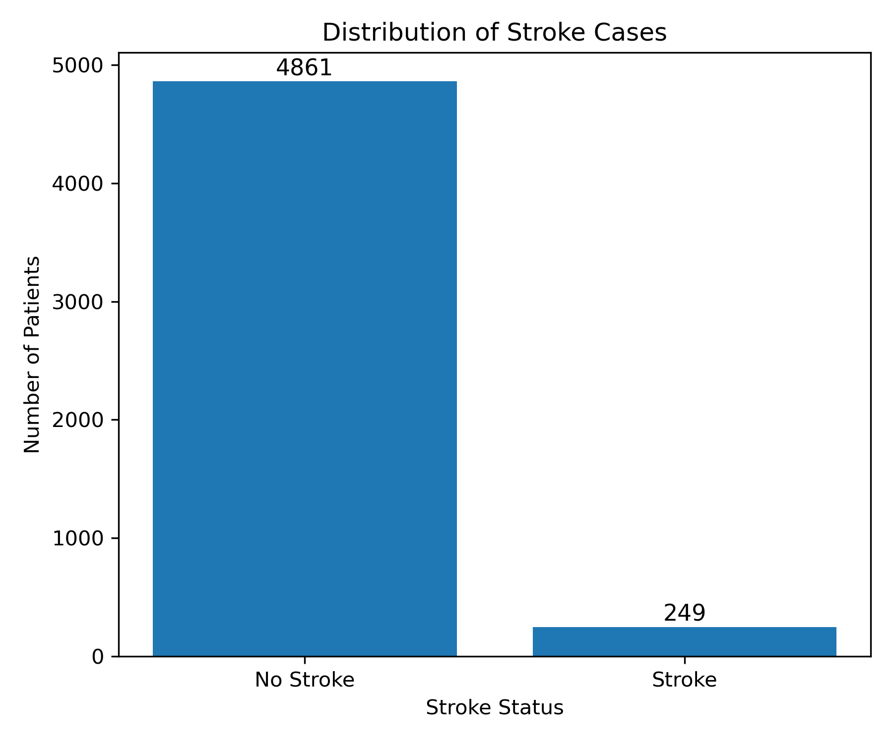
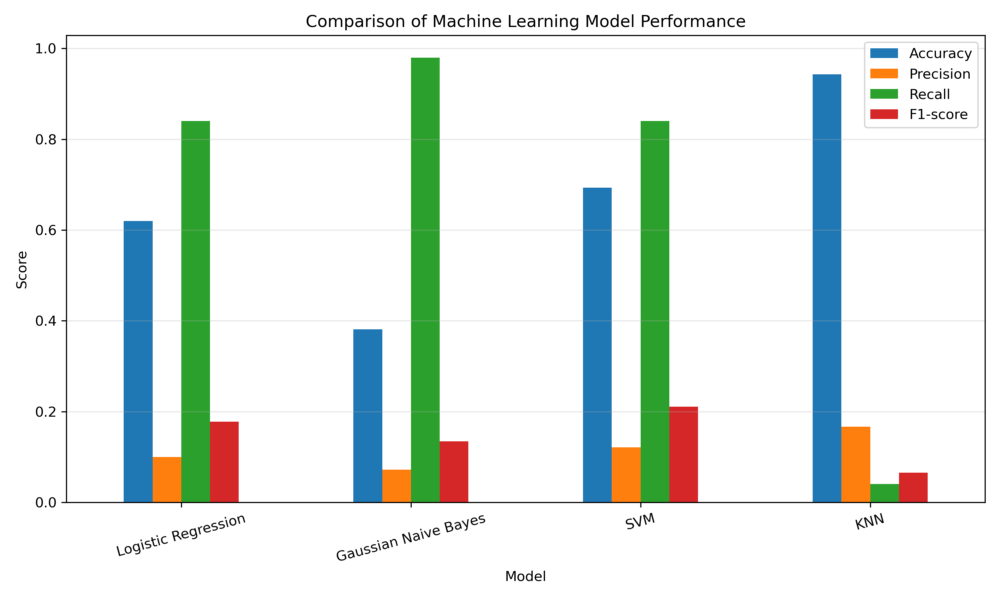
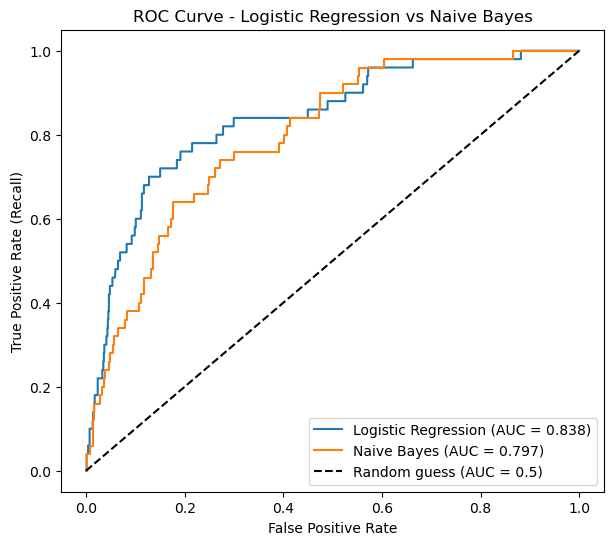

# 🏥 Beyond Accuracy: A Comparative Analysis of Probabilistic and Non-Probabilistic Machine Learning Models for Stroke Risk Screening


---

## Project Overview

Stroke is one of the leading causes of mortality and long-term disability worldwide. Early identification of individuals at risk can support timely intervention and improve patient outcomes.

This project develops and compares four supervised machine learning classification models for predicting stroke risk using demographic and clinical information. Rather than focusing solely on overall accuracy, the models were evaluated using healthcare-relevant metrics such as **Recall**, **Precision**, **F1-score**, and **Accuracy**.

The project demonstrates why model selection in healthcare should be driven by clinical priorities rather than accuracy alone.

---

## Objectives

This project aimed to:

- Predict stroke occurrence using patient demographic and clinical information.
- Compare probabilistic and non-probabilistic machine learning algorithms.
- Optimize model hyperparameters using GridSearchCV.
- Evaluate models using multiple performance metrics.
- Identify the most appropriate model for healthcare screening applications.

---
## 🌟 Project Highlights

- Compared **4 supervised machine learning algorithms**.
- Performed **hyperparameter tuning using GridSearchCV**.
- Optimized models using **Recall** as the primary scoring metric.
- Evaluated models using multiple performance metrics.
- Demonstrated why **accuracy alone can be misleading** for imbalanced healthcare datasets.

## Dataset

The dataset contains patient demographic and clinical information including:

- Age
- Gender
- Hypertension
- Heart Disease
- Ever Married
- Work Type
- Residence Type
- Average Glucose Level
- Body Mass Index (BMI)
- Smoking Status

**Target Variable**

- Stroke
  - 0 = No Stroke
  - 1 = Stroke

## 📊 Class Distribution

The dataset is highly imbalanced, with significantly fewer stroke cases than non-stroke cases. This imbalance explains why accuracy alone is not an appropriate evaluation metric for this problem and reinforces the importance of Recall during model evaluation.


---

## Data Preprocessing

Several preprocessing steps were performed before model development:

- Removed non-informative variables
- Handled missing BMI values
- Removed inconsistent categorical observations
- One-hot encoded categorical variables
- Standardized numerical variables
- Split the data into training and testing sets (80:20)

These preprocessing steps ensured that the models were trained on clean and appropriately formatted data.

---

## Machine Learning Workflow

```text
Raw Dataset
      │
      ▼
Data Cleaning
      │
      ▼
Missing Value Handling
      │
      ▼
Feature Encoding
      │
      ▼
Feature Scaling
      │
      ▼
Train-Test Split
      │
      ▼
Model Training
      │
      ▼
GridSearchCV
      │
      ▼
Model Evaluation
      │
      ▼
Performance Comparison
```

---

## Machine Learning Models

Four supervised learning algorithms were evaluated:

| Model | Category |
|--------|----------|
| Logistic Regression | Linear Classification |
| Gaussian Naïve Bayes | Probabilistic Classification |
| Support Vector Machine (SVM) | Margin-based Classification |
| K-Nearest Neighbours (KNN) | Instance-based Classification |

---

## Hyperparameter Tuning

Hyperparameters were optimized using **GridSearchCV** with **5-fold cross-validation**.

Unlike many introductory machine learning projects that optimize for accuracy by default, this study optimized using:

```python
scoring='recall'
```

This decision reflects the healthcare context of the problem.

---

## Why Recall?

In stroke prediction, failing to identify a patient who is genuinely at risk (a **false negative**) can have serious clinical consequences.

For this reason, **Recall** was prioritized during hyperparameter tuning to maximize the identification of potential stroke cases.

This demonstrates how evaluation metrics should be aligned with the real-world problem rather than selected arbitrarily.

---

## Model Performance

| Model | Accuracy | Precision | Recall | F1-score |
|:------|---------:|----------:|--------:|----------:|
| 🟢 Logistic Regression | **0.620** | **0.100** | **0.84** | **0.178** |
| 🔵 Gaussian Naïve Bayes | 0.381 | 0.072 | **0.98** | 0.134 |
| 🟠 Support Vector Machine | 0.693 | 0.121 | **0.84** | **0.211** |
| 🟣 K-Nearest Neighbours | **0.943** | 0.167 | 0.04 | 0.065 |

> **Key Insight**
>
> Although K-Nearest Neighbours achieved the highest accuracy (94.3%), its recall of only 4% makes it unsuitable for stroke screening because it failed to identify most positive stroke cases. This project therefore demonstrates why healthcare machine learning should not rely solely on accuracy when evaluating predictive models.

## 📊 Model Performance Comparison

The chart below compares the performance of the four machine learning models across the evaluation metrics used in this study.


---

## 📈 ROC Curve Analysis

The ROC curve compares the ability of probabilistic models to distinguish between stroke and non-stroke cases. Logistic Regression achieved an AUC of 0.838, showing stronger discrimination than Naive Bayes.




## Discussion

Several important observations emerged from this comparative analysis:

- K-Nearest Neighbours achieved the highest overall accuracy but identified very few stroke cases, making it unsuitable for healthcare screening.

- Gaussian Naïve Bayes achieved the highest recall, successfully identifying almost all stroke cases, but generated many false positives.

- Support Vector Machine achieved the highest F1-score, indicating a better balance between precision and recall.

- Logistic Regression achieved strong recall while remaining highly interpretable, making it a practical choice for clinical decision-support applications.

These findings highlight why healthcare machine learning projects should evaluate multiple metrics instead of relying solely on accuracy.

---

## Key Takeaways

- Four machine learning algorithms were compared using the same preprocessing pipeline.
- Hyperparameter tuning was performed using GridSearchCV.
- Recall was selected as the optimization metric because of the healthcare application.
- Accuracy alone proved insufficient for selecting the best screening model.
- Logistic Regression was recommended because it provided a clinically meaningful balance between predictive performance and interpretability.

---

## Repository Structure

```text
stroke-risk-classification-ml/

│── notebooks/
│      stroke_risk_classification.ipynb

│── report/
│      Stroke_Risk_Classification_Report.pdf

│── images/

│── requirements.txt

│── README.md

│── .gitignore
```

---

## Technologies Used

- Python
- Pandas
- NumPy
- Matplotlib
- Scikit-learn
- Jupyter Notebook

---

## Future Improvements

Potential extensions of this work include:

- Threshold optimization
- SMOTE for class imbalance
- Random Forest
- XGBoost
- Ensemble learning
- External validation using independent datasets

---

## Author

**Elechi Chinenye Mercy**

Public Health Professional | AI & Machine Learning Enthusiast

- GitHub: https://github.com/chinenyemercy5228-ship-it
- LinkedIn: www.linkedin.com/in/elechi-chinenye-freelancer

---

### If you found this project interesting, feel free to ⭐ the repository.
